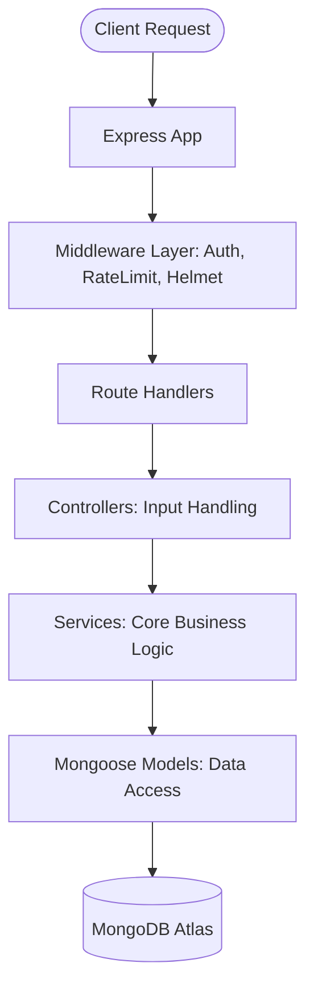

# UMA Server Architecture

This document outlines the backend architecture of the UMA project. It is designed for **Architects**, **Backend Engineers**, and **Security Auditors**.

## High-Level Flow

## Core Patterns

### 1. Service/Controller Pattern
To keep the application modular and testable, we separate the "What" from the "How":
- **Controllers**: Handle incoming HTTP requests, validate basic input, and send responses. (Path: `src/controllers/`)
- **Services**: Contain the core business logic. They are independent of Express and can be reused in background jobs or CLI scripts. (Path: `src/services/`)

### 2. Authentication & Authorization
- **JWT (JSON Web Tokens)**: We use a stateless authentication system.
- **Double-Token Strategy**: We issue an `AccessToken` (short-lived) and a `RefreshToken` (long-lived). This balances security and user convenience.
- **Role-Based Access Control (RBAC)**: Middleware checks the `role` field on the JWT to allow/deny access to specific endpoints.

### 3. Security Middleware
- **Helmet**: Adds security headers to prevent common attacks like Clickjacking.
- **Rate Limiter**: Prevents brute-force attacks on sensitive endpoints like `/login` and `/otp`.

## Data Modeling

We use **MongoDB (Mongoose)** for its flexibility in multi-tenant environments.
- **Tenant Isolation**: Every document (User, Team, Attendance) carries an `organisationId`.
- **Reference Pattern**: We use `ObjectId` references for relations (e.g., an Attendance log references a User and a Team).

## Scalability & Performance

- **Streaming Exports**: For large attendance reports, we use `ExcelJS` to build workbooks efficiently without loading the entire dataset into memory.
- **Audit Logs**: The `winston` logger captures errors and critical events, which can be piped to external services like ELK or Datadog.

---
**Role-Specific Tips:**
- **Architects**: Check `src/models/` to understand the data schema.
- **Devs**: See `src/utils/sendOtp.js` for external integrations.
